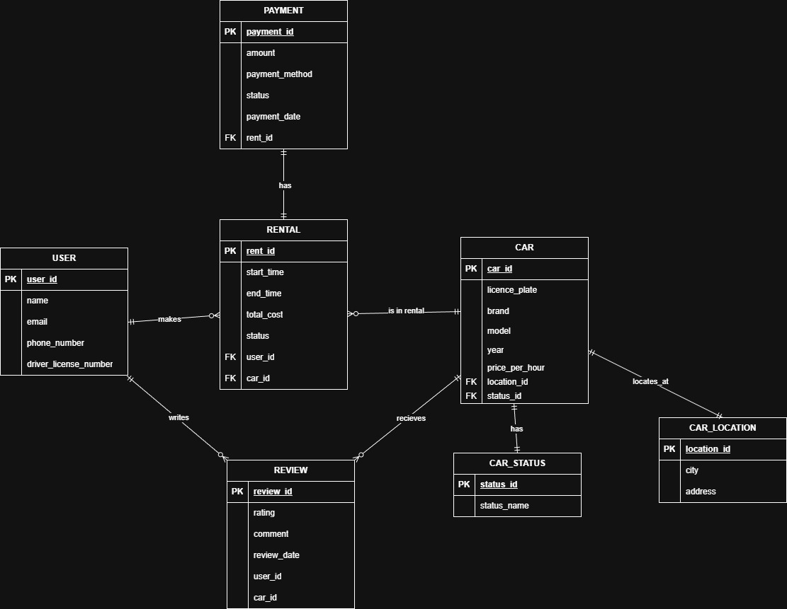

# Звіт до лабораторної роботи №1

**Тема:** Розробка концептуальної моделі бази даних для системи каршерингу.

## 1. Опис предметної області та вимоги

Система розробляється для автоматизації сервісу оренди автомобілів (Car Sharing). Головна мета — забезпечити взаємодію між користувачами та парком автомобілів, фіксувати поїздки та фінансові операції.

### Функціональні вимоги:
* **Управління користувачами:** Реєстрація клієнтів, зберігання контактних даних та інформації про водійське посвідчення.
* **Управління автопарком:** Облік автомобілів з чіткою прив'язкою до їх поточного місцезнаходження (локації) та технічного стану (статусу).
* **Оренда:** Фіксація факту бронювання та використання авто з прив'язкою до конкретного користувача та машини.
* **Фінанси:** Облік вартості поїздок та історії оплат.
* **Зворотний зв'язок:** Можливість залишати відгуки, які прив'язані до конкретного авто та користувача.

## 2. Сутності та атрибути

На основі аналізу вимог виділено наступні сутності. Для кожної сутності визначено первинні ключі (PK) та зовнішні ключі (FK), необхідні для зв'язків.

### USER — інформація про клієнта.
* `user_id` (PK): Унікальний ідентифікатор клієнта.
* `name`: ПІБ користувача.
* `email`, `phone_number`: Контактні дані.
* `driver_license_number`: Номер посвідчення (для валідації права керування).

### CAR — транспортний засіб.
* `car_id` (PK): Унікальний ідентифікатор авто.
* `license_plate`: Державний номерний знак.
* `brand`, `model`, `year`: Технічні характеристики.
* `price_per_hour`: Тарифна ставка.
* `location_id` (FK): Посилання на поточну локацію.
* `status_id` (FK): Посилання на поточний статус (вільна, в ремонті тощо).

### RENT — факт використання авто.
* `rent_id` (PK): Унікальний номер поїздки.
* `start_time`, `end_time`: Час початку та завершення.
* `total_cost`: Розрахована вартість.
* `status`: Стан поїздки (активна, завершена, скасована).
* `user_id` (FK): Хто орендував.
* `car_id` (FK): Яку машину орендували.

### PAYMENT — фінансові транзакції.
* `payment_id` (PK): Унікальний номер транзакції.
* `amount`: Сума оплати.
* `payment_method`: Спосіб оплати.
* `payment_date`: Дата та час транзакції.
* `rent_id` (FK): До якої поїздки відноситься оплата.

### REVIEW — оцінка сервісу.
* `review_id` (PK): Ідентифікатор відгуку.
* `rating`: Числова оцінка (наприклад, 1-5).
* `comment`: Текстовий коментар.
* `user_id` (FK): Автор відгуку.
* `car_id` (FK): Оцінюване авто.

### CAR_LOCATION — довідник паркувальних зон.
* `location_id` (PK): Ідентифікатор локації.
* `city`: Місто.
* `address`: Адреса або координати зони.

### CAR_STATUS — довідник можливих станів.
* `status_id` (PK): Ідентифікатор статусу.
* `status_name`: Назва статусу (Available, Rented, Maintenance).

## 3. Опис зв'язків та бізнес-правила

* **CAR_LOCATION — CAR (1:M):** Одна локація може містити багато автомобілів, але кожен конкретний автомобіль в один момент часу знаходиться лише в одній локації.
* **CAR_STATUS — CAR (1:M):** Один статус (наприклад, "В ремонті") може бути присвоєний багатьом машинам, але машина завжди має лише один поточний статус.
* **USER — RENT (1:M):** Один користувач може здійснити безліч поїздок, але кожна поїздка прив'язана до одного облікового запису користувача.
* **CAR — RENT (1:M):** Автомобіль бере участь у багатьох поїздках протягом свого життєвого циклу, але конкретний запис про оренду стосується однієї машини.
* **RENT — PAYMENT (1:M):** Одна поїздка може мати кілька спроб оплати або транзакцій, але кожна транзакція прив'язана до конкретної поїздки.
* **USER/CAR — REVIEW (1:M):** Користувачі залишають відгуки про конкретні автомобілі. Один відгук чітко посилається на одного користувача та одне авто.

## 4. ER діаграма
