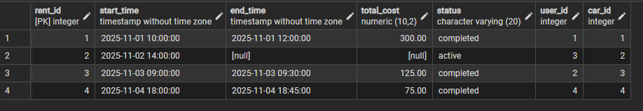
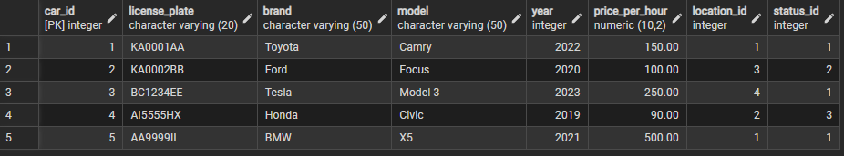

# Звіт до лабораторної роботи №2
**Тема:** Реалізація схеми бази даних у PostgreSQL.

## 1. Опис реалізації
На основі ER-діаграми з Лабораторної №1 було розроблено SQL-скрипт для створення таблиць.
Схема включає 7 таблиць:
* **Довідники:** `car_location`, `car_status` (незалежні таблиці).
* **Основні сутності:** `users`, `car` (має FK на location/status).
* **Операційні сутності:** `rent` (FK на users та car), `payment` (FK на rent), `review` (FK на users та car).

## 2. Ключові обмеження
У схемі використано наступні обмеження для забезпечення цілісності даних:
* **PRIMARY KEY:** У кожній таблиці (`id` з автоінкрементом `SERIAL`).
* **NOT NULL:** Для обов'язкових полів (наприклад, `email`, `license_plate`).
* **UNIQUE:** Для унікальних даних (`email`, `driver_license_number`, `license_plate`).
* **CHECK:** * `price_per_hour > 0`: ціна не може бути від'ємною.
  * `year > 1900`: рік випуску авто має бути реальним.
  * `rating >= 1 AND rating <= 5`: оцінка тільки в межах шкали.
* **FOREIGN KEY:**
  * `ON DELETE CASCADE`: Для `rent`, `payment`, `review`. Якщо видаляється користувач або авто — історія видаляється.
  * `ON DELETE RESTRICT`: Для `car_status`. Неможливо видалити статус, якщо він використовується автомобілем.

## 3. Наповнення даними
У кожну таблицю вставлено 3-5 тестових записів для перевірки роботи зв'язків.

### Скріншот результату вибірки даних (SELECT):

