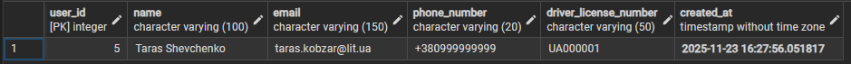
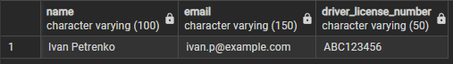
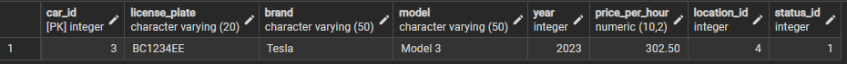

# Звіт до лабораторної роботи №3
**Тема:** Маніпулювання даними (DML) в PostgreSQL (OLTP).

---

## 1. Додавання даних (INSERT)
**Опис:** Додаємо нові записи в таблиці для імітації роботи системи: реєстрація нового клієнта та закупівля автомобіля.

**SQL-код виконання:**
```sql
-- Сценарій: Реєструємо нового користувача
INSERT INTO users (name, email, phone_number, driver_license_number)
VALUES ('Taras Shevchenko', 'taras.kobzar@lit.ua', '+380991234567', 'UA000001');

-- Сценарій: Купили нову машину (Hyundai Tucson) і поставили її в Києві
INSERT INTO car (license_plate, brand, model, year, price_per_hour, location_id, status_id)
VALUES ('KA7777KA', 'Hyundai', 'Tucson', 2024, 200.00, 1, 1);
```

**Результат виконання:**


---

## 2. Вибірка даних (SELECT)
**Опис:** Виконуємо пошукові запити з фільтрацією (`WHERE`) для отримання бізнес-інформації: пошук дешевих авто та перевірка історії клієнта.

**SQL-код виконання:**
```sql
-- Сценарій: Клієнт шукає всі вільні машини (status_id=1) дешевше 200 грн
SELECT brand, model, price_per_hour 
FROM car 
WHERE status_id = 1 AND price_per_hour < 200;

-- Сценарій: Знайти всі поїздки конкретного користувача (user_id=1)
SELECT * FROM rent WHERE user_id = 1;

-- Сценарій: Показати користувачів, чиї права починаються на 'ABC'
SELECT name, email, driver_license_number
FROM users
WHERE driver_license_number LIKE 'ABC%';
```

**Результат виконання:**


---

## 3. Оновлення даних (UPDATE)
**Опис:** Вносимо зміни в існуючі записи (контакти, статус авто, ціни). Використовуємо `WHERE`, щоб змінювати лише потрібні рядки.

**SQL-код виконання:**
```sql
-- Сценарій: Користувач змінив номер телефону
UPDATE users 
SET phone_number = '+380999999999' 
WHERE email = 'taras.kobzar@lit.ua';

-- Сценарій: Машина (KA0001AA) поїхала в ремонт (status_id=3)
UPDATE car
SET status_id = 3 
WHERE license_plate = 'KA0001AA';

-- Сценарій: Підняття цін на 10% для всіх машин бренду Tesla
UPDATE car
SET price_per_hour = price_per_hour * 1.10
WHERE brand = 'Tesla';
```

**Результат виконання:**


---

## 4. Видалення даних (DELETE)
**Опис:** Видаляємо застарілі або помилкові дані з використанням умов `WHERE` для безпеки.

**SQL-код виконання:**
```sql
-- Сценарій: Видаляємо відгуки конкретного користувача (модерація)
DELETE FROM review 
WHERE user_id = 4;

-- Сценарій: Списання старих авто (модель Civic старше 2020 року)
DELETE FROM car 
WHERE model = 'Civic' AND year < 2020;
```

