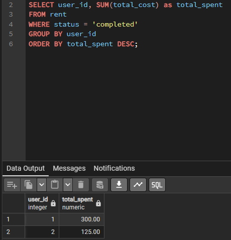
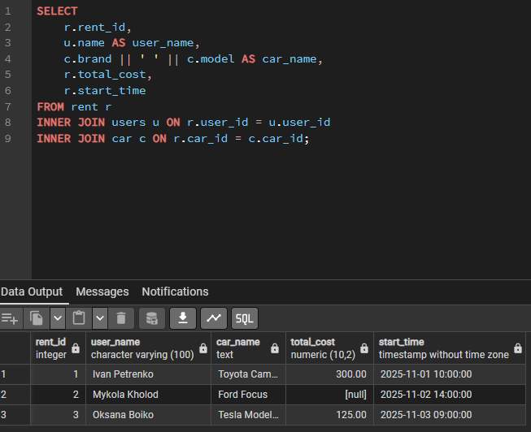
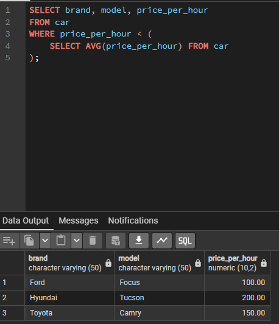

# Звіт до лабораторної роботи №4
**Тема:** Аналітичні SQL-запити (OLAP).
**Мета:** Навчитися використовувати агрегатні функції, об'єднання таблиць та підзапити для аналізу даних.

---

## 1. Агрегація та групування
Використано функції `COUNT`, `AVG`, `MAX`, `SUM` для отримання зведеної статистики з даних.

**Виконані SQL-запити:**

1. **Базова статистика:** Аналіз цін та загальна кількість авто.
2. **Групування:** Підрахунок кількості авто в розрізі брендів.
3. **Фінансовий аналіз:** Сума витрат кожного користувача.
4. **Фільтрація груп:** Використання `HAVING`, щоб знайти локації, де стоїть більше 1 машини.

```sql
-- 1. Базова статистика: Середня ціна оренди та крайнощі
SELECT 
    COUNT(*) as total_cars,
    AVG(price_per_hour) as average_price,
    MAX(price_per_hour) as max_price,
    MIN(price_per_hour) as min_price
FROM car;

-- 2. Групування: Скільки машин кожного бренду є в автопарку
SELECT brand, COUNT(*) as car_count
FROM car
GROUP BY brand
ORDER BY car_count DESC;

-- 3. Групування + Сортування: Загальний дохід від кожного користувача
SELECT user_id, SUM(total_cost) as total_spent
FROM rent
WHERE status = 'completed'
GROUP BY user_id
ORDER BY total_spent DESC;

-- 4. Фільтрація груп (HAVING): Локації з > 1 машиною
SELECT location_id, COUNT(*) as cars_at_location
FROM car
GROUP BY location_id
HAVING COUNT(*) > 1;
```

**Результат виконання:**


---

## 2. Об'єднання таблиць (JOINs)
Використано різні типи з'єднань для зведення даних з таблиць `users`, `car`, `rent`.

**Виконані SQL-запити:**

1. **INNER JOIN:** Отримання повної інформації про оренду (з'єднання 3-х таблиць: Оренда, Юзер, Авто).
2. **LEFT JOIN:** Аналіз активності користувачів. Дозволяє побачити навіть тих клієнтів, які ще не зробили жодної поїздки.
3. **CROSS JOIN:** Генерація матриці "Користувач-Авто" (комбінація всіх варіантів).

```sql
-- 5. INNER JOIN: Детальна інформація про поїздки
SELECT 
    r.rent_id,
    u.name AS user_name,
    c.brand || ' ' || c.model AS car_name,
    r.total_cost,
    r.start_time
FROM rent r
INNER JOIN users u ON r.user_id = u.user_id
INNER JOIN car c ON r.car_id = c.car_id;

-- 6. LEFT JOIN: Статистика користувачів
SELECT 
    u.name,
    COUNT(r.rent_id) as total_trips
FROM users u
LEFT JOIN rent r ON u.user_id = r.user_id
GROUP BY u.name;

-- 7. CROSS JOIN: Матриця можливих бронювань
SELECT 
    u.name as user,
    c.brand || ' ' || c.model as potential_car
FROM users u
CROSS JOIN car c
LIMIT 10;
```

**Результат виконання:**


---

## 3. Підзапити (Subqueries)
Реалізовано вкладені запити для виконання складних вибірок, де умова залежить від іншого запиту.

**Виконані SQL-запити:**

1. **Підзапит у WHERE:** Пошук "бюджетних" авто, ціна яких нижча за середню по всьому парку.
2. **Підзапит у SELECT:** Вивід кількості відгуків прямо у списку автомобілів (корельований підзапит).
3. **Підзапит з IN:** Пошук клієнтів, які користувалися конкретним брендом (Tesla).

```sql
-- 8. Підзапит у WHERE: Знайти машини, які дешевші за середню ціну
SELECT brand, model, price_per_hour
FROM car
WHERE price_per_hour < (
    SELECT AVG(price_per_hour) FROM car
);

-- 9. Підзапит у SELECT: Список машин і кількість відгуків про кожну
SELECT 
    brand, 
    model,
    (SELECT COUNT(*) FROM review WHERE review.car_id = car.car_id) as review_count
FROM car;

-- 10. Підзапит з IN: Знайти користувачів, які їздили на Tesla
SELECT name, email
FROM users
WHERE user_id IN (
    SELECT r.user_id 
    FROM rent r
    JOIN car c ON r.car_id = c.car_id
    WHERE c.brand = 'Tesla'
);
```

**Результат виконання:**
